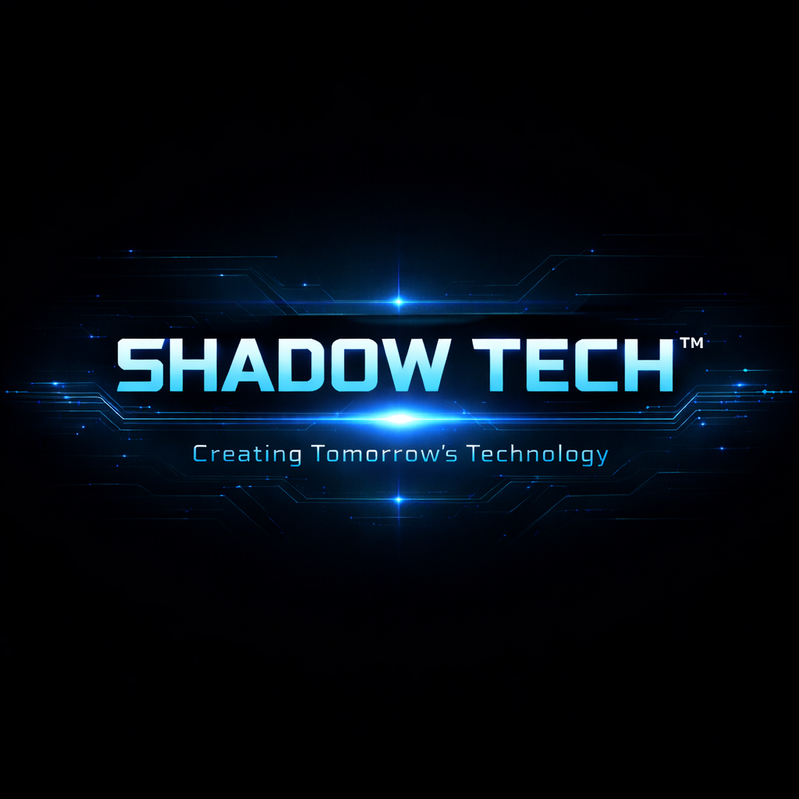

# SHADOW TECH™

### Creating Tomorrow’s Technology

<b>Web Infrastructure • Backend APIs • Automation Engineering</b>

 

  

---

---

## ⚡ Shadow Tech Overview

Shadow Tech™ is a modern engineering brand focused on building scalable web platforms, backend infrastructure, and automation systems.

We specialize in:

- Production-ready architectures  
- Secure API development  
- High-performance backend systems  
- Automation-driven workflows  
- Scalable infrastructure  

---

## 📊 Performance Metrics

---

## 🛠 Technology Stack

### Frontend Systems

### Backend Infrastructure

### Automation & DevOps

---

## 🚀 Featured Systems

| Project | Description | Status |
-------- | ----------- | ------
ShadowPanel | Web dashboard & admin control system | Active  
ShadowAPI | Production-ready REST backend engine | Active  
ShadowBot | Automation & background task engine | In Progress  

---

## 📈 Development Activity

---

## 🧠 Engineering Philosophy

- Clean architecture over messy code  
- Systems over shortcuts  
- Performance before appearance  
- Automation over repetition  
- Scalability by design  

---

## 🎯 Mission Statement

> Creating Tomorrow’s Technology by engineering scalable, secure, and high-performance digital systems.

---

---

© SHADOW TECH™ — Creating Tomorrow’s Technology

We focus on:

- Production-ready architectures  
- Performance-first development  
- Secure backend systems  
- Automation-driven workflows  

---

## 📊 Performance Metrics

---

## 🧠 Technology Stack

### Frontend

### Backend

### DevOps / Automation

---

## 🚀 Engineering Domains

| Area | Focus |
------ | ------
Web Systems | Dashboards, SaaS Interfaces  
Backend APIs | Auth, Services, Data Layers  
Automation | Scripts, Bots, Pipelines  
Infrastructure | Optimization & Tooling  

---

## 📈 Activity Graph

---

## 🎯 Mission

> Creating Tomorrow’s Technology by building scalable, secure and high-performance digital systems.

---

© SHADOW TECH™ — Creating Tomorrow’s Technology

